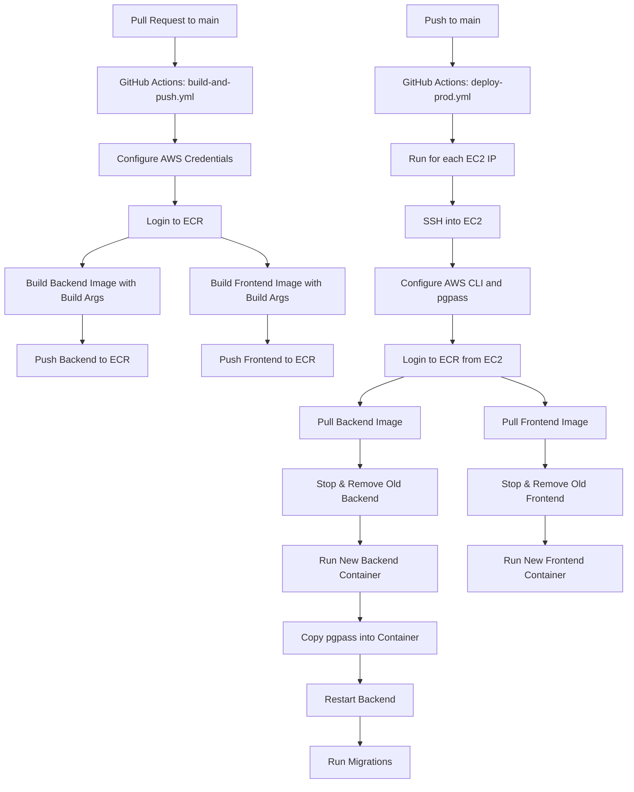

# CI/CD Pipeline

This page outlines the continuous integration and continuous deployment (CI/CD) process for the AME Timesheets platform.

## Full CI/CD Pipeline Diagram

## Overview

Our CI/CD system uses GitHub Actions to automate the building, testing, and deployment of our backend (Django) and frontend (React) services. The process involves two main workflows:

1. **build-and-push.yml** – Builds Docker images and pushes them to AWS ECR when a pull request is created or updated.
2. **deploy-prod.yml** – Deploys the latest images to our EC2 instances on every push to the `main` branch.

---

## Step-by-Step Breakdown

### 1. Pull Request Trigger (build-and-push.yml)

- Trigger: Any PR targeting `main`
- Steps:
  - Configure AWS credentials
  - Log in to Amazon ECR
  - Build the backend Docker image (injecting secrets and environment variables)
  - Build the frontend Docker image (injecting Vite-specific env vars)
  - Push both images to the appropriate AWS ECR repositories

### 2. Main Branch Push Trigger (deploy-prod.yml)

- Trigger: Push to `main`
- Strategy: Runs per EC2 IP
- Steps:
  - SSH into each EC2 instance
  - Configure AWS CLI and PostgreSQL passwordless authentication
  - Pull latest backend and frontend images from ECR
  - Clean up old containers and volumes
  - Run new containers
  - Run Django migrations for backend

---

If you notice anything outdated or missing, please open a PR or message in the internal dev channel.